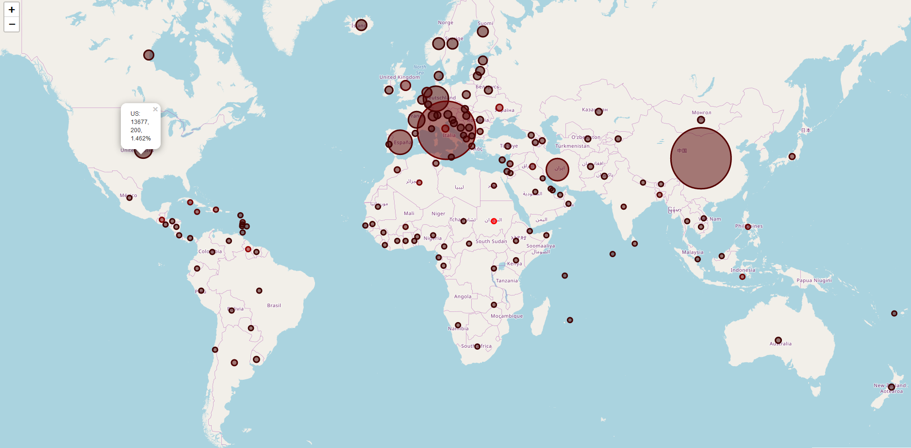

# Carte du Coronavirus
*Lire ceci endee: [English](README.md)*

Ceci est une carte qui montre le nombre de contaminations, de morts, et taux de mortalité pour chaque pays. Visuellement, il montre par la taille des cercles et la rougeur de ceux-ci.

Une vue actuelle peut être trouvée [ici](https://coronavirus-map-with-circles.herokuapp.com/).

## Comment Ça Marche
Le script python accède à un autre [dépôt par pomber](https://github.com/pomber/covid19) pour obtenir le nombre actuel de cas et à un fichier csv pour obtenir le latitutde et la longitude de chaque pays. Ensuite, il utilise la [bibliothèque folium](https://python-visualization.github.io/folium/) pour cartographier le tout.

